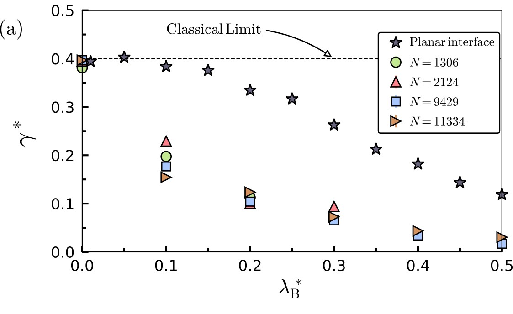

# Unmasking quantum effects in the surface thermodynamics of fluid nanodrops

 Sergio Contreras $^1$, Alejandro Martínez-Borquez $^2$, Carlos Avendaño $^3$, Alejandro Gil-Villegas $^1$, and George Jackson $^4$ 

&nbsp;&nbsp;&nbsp;&nbsp;&nbsp;&nbsp; $^1$ *División de Ciencias e Ingenierías, Campus León, Universidad de Guanajuato, Loma del Bosque 103, Lomas del Campestre, León 37150,* 
&nbsp;&nbsp;&nbsp;&nbsp;&nbsp;&nbsp;&nbsp;&nbsp;&nbsp;*Guanajuato, México.*

&nbsp;&nbsp;&nbsp;&nbsp;&nbsp;&nbsp; $~^2$ *Tecnologico de Monterrey, School of Engineering and Sciences, León 37190, Guanajuato, México.* 

 &nbsp;&nbsp;&nbsp;&nbsp;&nbsp;&nbsp; $~^3$*Department of Chemical Engineering, University of Manchester, Oxford Road, Manchester M13 9PL, UK.* 
 
 &nbsp;&nbsp;&nbsp;&nbsp;&nbsp;&nbsp; $~^4$ *Department of Chemical Engineering, Imperial College London, South Kensington Campus, London SW7 2AZ, UK.*
 

##  ABSTRACT

 The focus of our study is an in-depth investigation of the quantum effects associated with the surface tension and other thermodynamic properties of nanoscopic liquid drops. The behaviour of drops of quantum 
Lennard- Jones fluids is investigated with path-integral Monte Carlo simulations, and the test-area method
is used to determine the surface tension of the spherical vapour-liquid interface. As the thermal de Broglie
wavelength, $\lambda _B$, becomes more significant, the average density of the liquid drop decreases, with the drop
becoming mechanically unstable at large wavelengths. As a consequence the surface tension is found to decrease monotonically with $\lambda _B$, vanishing altogether for dominant quantum interactions. Quantum effects can
be significant leading to values which are notably lower than the classical thermodynamic limit, particularly
for smaller drops. For planar interfaces (with infinite periodicity in the direction parallel to the interface),
quantum effects are much less significant with the same values of $\lambda _B$, but are nevertheless consequential for
values corresponding to hydrogen or helium at the low temperatures of vapour-liquid coexistence. Large
quantum effects are found for small drops of molecules with quantum interactions corresponding to water,
ethane, methanol, and carbon dioxide, even at ambient conditions. The notable decrease in the density and
tension has important consequences in reducing the free-energy barrier of a nucleating cluster resulting in an
enhancement of nucleation kinetics of liquid drops and of bubble formation. This implies that drops would
form at a much greater rate than is predicted by the classical nucleation theory. 
 
DOI: 

## Cite this work

## Computer Simulation Monte Carlo

